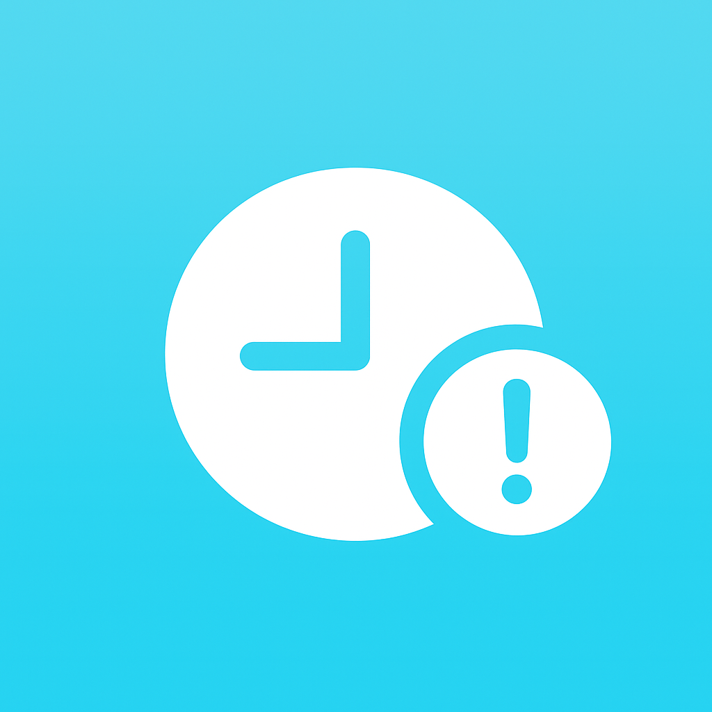

<p align="center">
  
</p>

# EventCountdownApp

EventCountdownApp is a SwiftUI experience for tracking upcoming milestones with live countdowns, calendar importing, and celebratory notifications. It keeps your events in sync across launches, surfaces haptics + sound when moments arrive, and provides a friendly editing workflow optimized for touch.

## Highlights
- **Delightful countdowns:** Emoji-enhanced cards show days, hours, minutes, and seconds remaining with monospaced digits for clarity.
- **One list, many sources:** Create events manually or pull the next 12 months from your system calendar (with permission).
- **Smart notifications:** Local notifications stay aligned with your data even after edits or deletions.
- **Celebration moment:** When a date hits, the app plays haptics, sound, and an alert banner so you never miss the moment.

## Screenshots
| Countdown List | Celebration Alert |
| --- | --- |
|  |  |

## Architecture & Project Layout
```
EventCountdownApp/
├─ App/                       # Entry point and scene configuration
├─ Features/Countdown/        # Feature-specific views, view models, and models
├─ Services/                  # Reusable helpers (notifications, etc.)
├─ Assets.xcassets/           # Colors, app icon, imagery
└─ EventCountdownAppTests/    # XCTest targets (mirror production folders)
```
- `CountdownListViewModel` centralizes persistence, notification scheduling, and EventKit importing.
- `AddEventView`, `EventCard`, and `CountdownListView` compose the UI using SwiftUI + an observable view model.
- `CountdownNotificationManager` wraps `UNUserNotificationCenter` so permissions and scheduling stay tidy.

## Getting Started
1. Open `EventCountdownApp.xcodeproj` in Xcode 15 or newer.
2. Select an `iPhone 15` (or newer) simulator target.
3. Press `⌘R` to build & run. Accept the notification prompt to enable reminders.

### Command-Line Builds
```bash
# Launch an iOS 17 simulator build
xcodebuild -scheme EventCountdownApp -destination 'platform=iOS Simulator,name=iPhone 15' build

# Run the XCTest suite
xcodebuild test -scheme EventCountdownApp -destination 'platform=iOS Simulator,name=iPhone 15'
```

## Implementation Notes
- Events persist via `UserDefaults` making it simple to retain state without Core Data overhead.
- Calendar syncing deduplicates events by combining the title + day, preventing import spam.
- Notification scheduling is idempotent; the manager clears stale identifiers before recreating requests.
- All preview-only helpers should live under `EventCountdownApp/Shared/PreviewSupport` and be wrapped in `#if DEBUG` (add as the app grows).

## Contributing
- Follow Swift API Design guidelines (UpperCamelCase for types, lowerCamelCase for members) and keep files under ~200 lines by extracting subviews.
- Run `xcodebuild test …` (or `⌘U`) before raising a PR; attach simulator screenshots for UI tweaks.
- Use Conventional Commits (`feat:`, `fix:`, `chore:`) and include testing notes/screens when opening pull requests.

Enjoy counting down to the good stuff! 🎉
